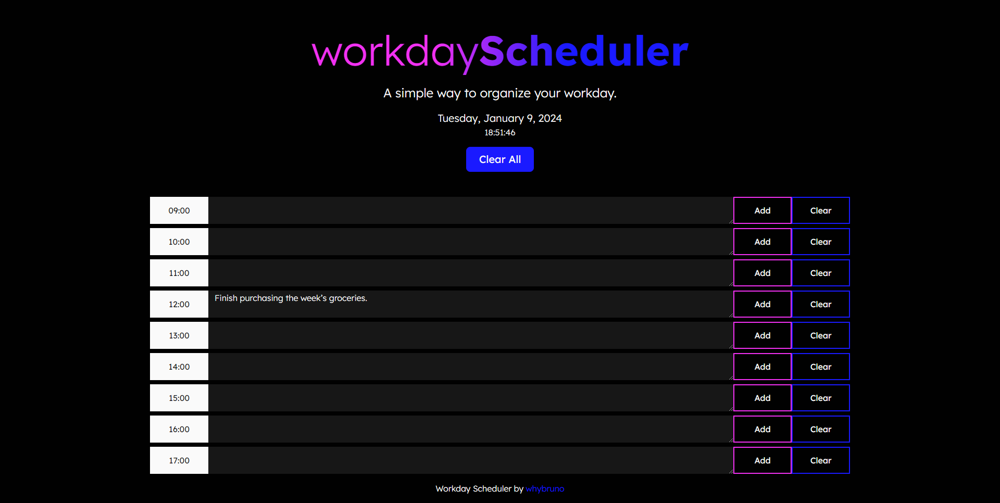
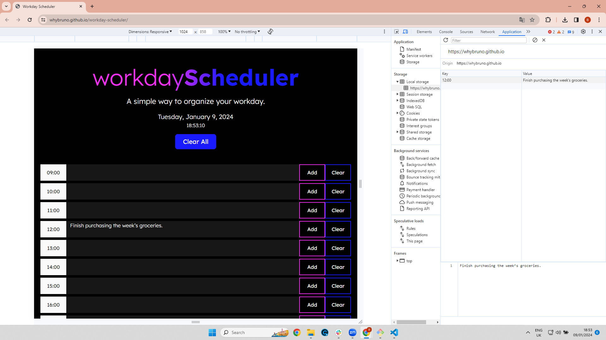

# :full_moon: About The Project

**Workday-Scheduler** is a Web App for you to organize your workday by hour, entering some notes your way. This is the challenge of the week at the **edX Front-End Web Development Bootcamp**.

# :waxing_gibbous_moon: Features

- JavaScript
- Window localStorage
- Day.js

# :first_quarter_moon: Screenshot

# :waxing_crescent_moon: Acceptance Criteria

- Display the current day at the top of the calender when a user opens the planner.
- Present time blocks for standard business hours when the user scrolls down.
- Color-code each time block based on past, present, and future when the time block is viewed.
- Allow a user to enter an event when they click a time block
- Save the event in local storage when the save button is clicked in that time block.
- Persist events between refreshes of a page

# :new_moon: Technologies

- HTML
- CSS
- JAVASCRIPT
- JQUERY
- BOOTSTRAP

# :globe_with_meridians: Website

- [Workday-Scheduler](https://whybruno.github.io/workday-scheduler)

# :copyright: Credits

N/A

# :registered: License

MIT License